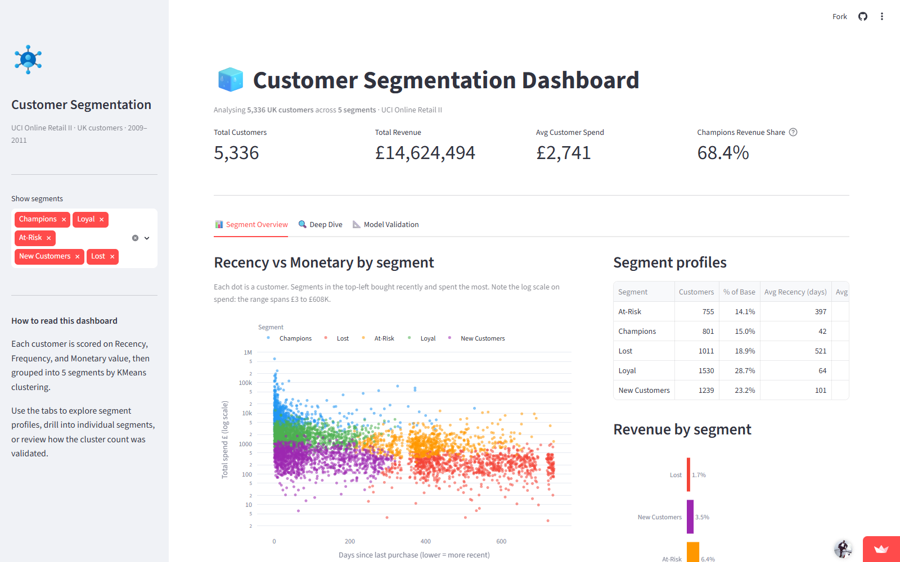

# Customer Segmentation Dashboard

Built this to answer a question marketing teams always struggle with: *which customers actually matter, and what should we do differently for each of them?*

Most businesses treat their entire customer base the same way: same email, same discount, same messaging. This project uses RFM analysis and KMeans clustering on real transaction data to show exactly why that's a mistake.

**Live demo:** [keni-customer-segmentation.streamlit.app](https://keni-customer-segmentation.streamlit.app/)

---

## Live dashboard

**→ [View on Streamlit Cloud](https://keni-customer-segmentation.streamlit.app/)**



Use the sidebar to filter by segment. The scatter plot, segment table, and revenue chart all update in real time.

---

## Sample outputs

| Output | Description |
|--------|-------------|
| [Project case study](samples/customer-segmentation-case-study.pdf) | Full write-up: the business problem, what each segment means, how the dashboard supports decisions, and technical architecture |

---

## What I found

Running this on the UCI Online Retail II dataset (~1M UK transactions, 2009–2011):

- **801 customers (15% of the base) were responsible for 68% of total revenue**, the Champions segment
- The Lost segment (1,011 customers) contributed just 1.7% of revenue despite being nearly 19% of the base
- At-Risk customers had strong historical spend but hadn't purchased in months, a clear win-back opportunity

These aren't insights you'd find by looking at aggregate revenue numbers. You need to segment first.

## How it works

Three pipeline steps, then a Streamlit dashboard:

1. **clean.py**: strips out cancellations, returns, null customer IDs, admin charges, and non-UK transactions from the raw Excel file
2. **rfm.py**: calculates Recency (days since last purchase), Frequency (number of orders), and Monetary value (total spend) per customer, then scores each dimension 1-5 using quintile binning
3. **segment.py**: applies StandardScaler and KMeans (k=5, validated with elbow + silhouette analysis) to group customers into Champions, Loyal, At-Risk, New Customers, and Lost

The dashboard lets you explore each segment's profile, see their top products, and review the recommended action for each group.

## Stack

`Python · pandas · scikit-learn · Plotly · Streamlit`

## Getting started

```bash
git clone https://github.com/kenechukwuagbodike/customer-segmentation.git
cd customer-segmentation

python -m venv .venv
.venv\Scripts\Activate.ps1        # Windows PowerShell
pip install -r requirements.txt
```

Download `online_retail_II.xlsx` from the [UCI Machine Learning Repository](https://archive.ics.uci.edu/dataset/502/online+retail+ii) and drop it in `data/`.

Then run the pipeline in order:

```bash
python pipeline/clean.py
python pipeline/rfm.py
python pipeline/segment.py
```

Launch the dashboard:

```bash
streamlit run dashboard/app.py
```

## Project structure

```
customer-segmentation/
├── data/           Raw + processed data (large files excluded from git)
├── pipeline/
│   ├── clean.py
│   ├── rfm.py
│   └── segment.py
├── dashboard/
│   └── app.py
├── models/         Saved KMeans + scaler .pkl files
├── documentation/
│   └── scripts/
│       └── generate_case_study.py   Regenerates the case study PDF
├── samples/
│   ├── dashboard-screenshot.png             Live dashboard screenshot
│   └── customer-segmentation-case-study.pdf Case study (visible on GitHub)
└── requirements.txt
```

---

**Kene Agbodike**, Data & AI Decision Systems Consultant

Microsoft Fabric Data Engineer · Fabric Analytics Engineer · Azure Solutions Architect · Azure AI Engineer · Azure Data Scientist

[GitHub](https://github.com/kenechukwuagbodike) · [Upwork](https://www.upwork.com/freelancers/~01ffe0a90179159b67)
